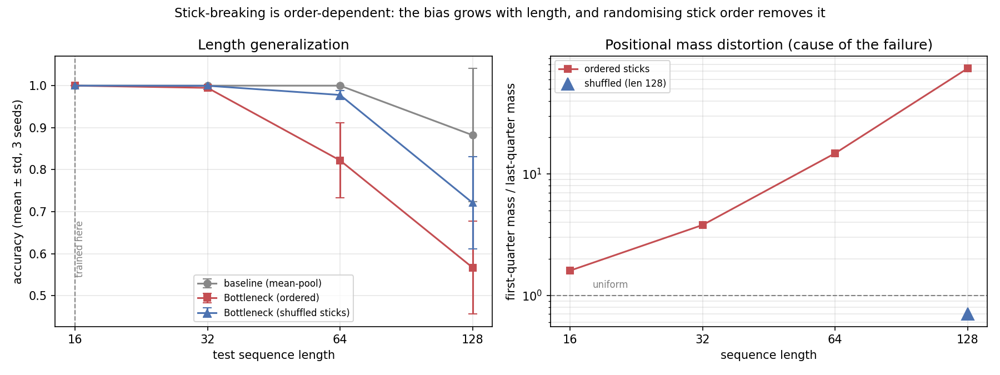
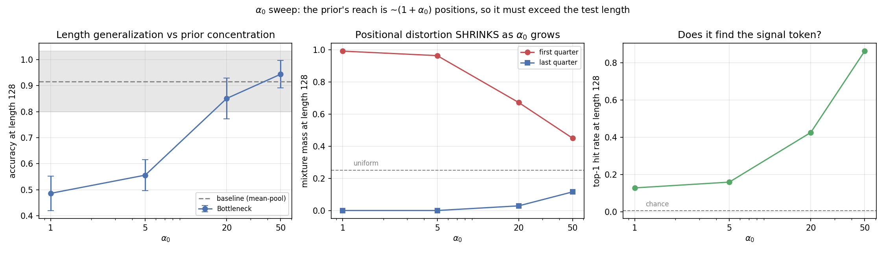

# A Variational Bottleneck on Attention — a Negative Result, Diagnosed

Standard attention pooling is unconstrained: a fixed operator (mean, max, a
summary token) treats every input the same way regardless of how much of it is
informative. This project constrains it **probabilistically** — a
stick-breaking variational prior replaces fixed pooling, so the model must
*commit* to a few tokens instead of averaging over all of them.

**Hypothesis:** that commitment should improve generalization to sequences
longer than anything seen in training.

**Result, in two stages.** At the α₀ this project originally used, the
hypothesis looked false: the bottleneck was dramatically better than the
baseline where it could see and blind everywhere else, traced to stick-
breaking's order-dependence — later positions can only receive what earlier
ones leave behind.

Then an α₀ sweep showed that the failure was **an artifact of a badly chosen
hyperparameter** — one chosen from a misreading of what the prior's
concentration parameter does. At α₀ = 50 the bottleneck reaches parity with
mean-pooling. Both stages are reported below, in the order they happened.

## Scope and honesty — read before anything else

A full nonparametric treatment of "how many components does this pooling
step need" would place a Dirichlet Process prior over the token mixture,
with per-token pseudo-counts and a proper Dirichlet KL term. That is a
research-scale construction on its own.

What is implemented here is a deliberately tractable proxy: a stick-breaking
process made differentiable via the Kumaraswamy relaxation, which keeps the
core idea (a nonparametric-flavoured prior regularising *how many* components
get used, alongside a Gaussian VAE-style posterior over *what* each
component contributes, both folded into one KL term) while giving up the
full Dirichlet Process's exchangeability — stick-breaking as implemented here
is **order-dependent** on the input sequence, which turns out to be exactly
the property that matters (see section 2 below).

## Mechanism

Given hidden states `H ∈ R^(B×T×D)`:

1. Each token emits Kumaraswamy `(a, b)`; sampled sticks `v_k` give weights
   `π_k = v_k · Π_{j<k}(1 − v_j)`, prior `Beta(1, α₀)`. `E[v] = 1/(1+α₀)`, so
   **larger `α₀` takes smaller slices at each break and spreads mass over
   *more* sticks — the mixture becomes more uniform, not sparser.** This is
   standard Dirichlet Process behaviour (α₀ is a concentration parameter in
   the DP sense: larger α means *more* effective clusters, not fewer) and is
   the opposite of what "sparsity-inducing" suggested in earlier drafts of
   this README. The α₀ sweep below is what caught the error.
   The Kumaraswamy relaxation is what makes stick-breaking differentiable at
   all, rather than requiring a high-variance score-function estimator — the
   load-bearing technical choice.
2. Each token emits `(μ, log σ²)`; sample `z_t = μ_t + σ_t · ε`.
3. `pooled = Σ_t π_t · z_t`.
4. `KL = KL_gauss(q(z) ‖ N(0,I)) + KL_kumaraswamy(q(v) ‖ Beta(1, α₀))`.

## Task

Sequence classification where **exactly one token determines the label** and
the rest is noise. Train at length 16, evaluate at 16 / 32 / 64 / 128.

Signal is held constant while distractors multiply, so length generalization is
isolated from every other variable. Crucially, **the ground-truth informative
position is known**, which is what makes the diagnosis below possible at all —
on a real benchmark this failure would have been invisible.

Baseline: identical encoder, uniform masked mean-pooling instead of the
bottleneck. The pooling operator is the only difference.

## Results

3 seeds (42, 43, 44), 1500 steps, `α₀ = 5.0`, `kl_weight = 0.01`.
Held-out accuracy, mean ± std:

| test length | baseline | stick-breaking bottleneck |
|---|---|---|
| 16 *(train)* | **1.000** ± 0.000 | **1.000** ± 0.000 |
| 32 | **1.000** ± 0.000 | 0.995 ± 0.004 |
| 64 | **1.000** ± 0.000 | 0.822 ± 0.089 |
| 128 | **0.882** ± 0.159 | 0.567 ± 0.111 |

Both models solve the training length perfectly. The bottleneck then degrades
*faster*, and the gap at length 128 (0.315) is roughly 2σ of the baseline's own
spread — outside noise, though the baseline's ±0.159 is itself large enough that
the 128 row should be read cautiously.

Taken alone this reads as "the sparsity prior hurts." That conclusion is wrong.



*Left: the ordered stick-breaking bottleneck (red) degrades fastest; randomising
stick order (blue) recovers most of the gap. Right: the cause — first-quarter to
last-quarter mass ratio on a log scale, rising to 74× at length 128 and
collapsing to 0.7× under the shuffle.*

### 1. The sparsity mechanism works — very well

`python analyze_attention.py` measures the mixture weights `π` against the
known signal position:

| seq_len | mass on signal token | chance | concentration | top-1 hit rate |
|---|---|---|---|---|
| 16 | 0.830 | 0.062 | **13.3×** | **1.000** |
| 32 | 0.607 | 0.031 | **19.4×** | 0.951 |
| 64 | 0.371 | 0.016 | **23.7×** | 0.733 |
| 128 | 0.201 | 0.008 | **25.7×** | 0.380 |

At training length the bottleneck puts **83% of its mass on the one token that
matters** and identifies it in 100% of examples. This is exactly the
interpretability property this design is supposed to deliver, and it is
confirmed here directly rather than inferred from accuracy.

Note the concentration ratio *rises* with length (13× → 26×) while absolute
mass *falls* (0.83 → 0.20). The model keeps trying to concentrate; something
else is taking the mass away.

### 2. The cause: stick-breaking is order-dependent

`π_k = v_k · Π_{j<k}(1 − v_j)` — later sticks can only receive what earlier
sticks leave behind. Averaging `π` by absolute position, ignoring content:

| seq_len | first ¼ of mass | last ¼ | uniform would be | first/last |
|---|---|---|---|---|
| 16 | 0.317 | 0.202 | 0.250 | 1.6× |
| 32 | 0.334 | 0.087 | 0.250 | 3.8× |
| 64 | 0.578 | 0.039 | 0.250 | 14.8× |
| 128 | **0.713** | **0.009** | 0.250 | **78.2×** |

At length 128 the final quarter of the sequence receives **0.9% of the mixture
mass, regardless of what is in it.** The model is structurally blind to its own
tail. At the training length of 16 the bias is only 1.6×, which is why nothing
is visible until evaluation goes out of distribution.

### 3. Confirmation: accuracy tracks position exactly

Accuracy at length 128, split by where the signal token happens to sit:

| signal position | baseline | stick-breaking bottleneck |
|---|---|---|
| [0, 32) | 0.738 | **1.000** |
| [32, 64) | 0.504 | **0.890** |
| [64, 96) | 0.680 | 0.678 |
| [96, 128) | **0.693** | 0.362 |

This inverts the headline. Where the bottleneck can see, it is **far** better
than mean-pooling — 1.000 vs 0.738 in the first quarter, on a length it never
trained at. Where stick-breaking has starved it of mass, it collapses to 0.362.
The aggregate number (0.567 vs 0.882) averages a large win and a large loss into
a misleading single figure.

### 4. The decisive test: randomise the stick order

Sections 1–3 establish a correlation between positional mass bias and the
accuracy drop. The intervention that makes it causal: draw a **fresh random
stick order per example** (`--shuffle_sticks`), restoring exchangeability in
expectation while changing nothing else — same architecture, same
hyperparameters, same seeds, same data.

If order-dependence is the cause, the bias must vanish and accuracy must
recover. Both happen:

| seq_len | ordered | **shuffled** | baseline |
|---|---|---|---|
| 16 *(train)* | 1.000 ± 0.000 | 1.000 ± 0.000 | 1.000 ± 0.000 |
| 32 | 0.995 ± 0.004 | **1.000** ± 0.000 | 1.000 ± 0.000 |
| 64 | 0.822 ± 0.089 | **0.978** ± 0.010 | 1.000 ± 0.000 |
| 128 | 0.567 ± 0.111 | **0.721** ± 0.110 | 0.882 ± 0.163 |

And the mechanism it was supposed to fix, at length 128:

| | first ¼ mass | last ¼ mass | ratio | top-1 hit rate |
|---|---|---|---|---|
| ordered | 0.722 | 0.010 | **74.0×** | 0.416 |
| **shuffled** | 0.200 | 0.281 | **0.7×** | **0.699** |

The positional bias collapses from 74× to 0.7× — essentially uniform — and
length generalization gains **+15.6 points at 64** and **+15.4 points at 128**.
The variance at length 64 also drops from ±0.089 to ±0.010: the ordered
version's instability across seeds was itself an artifact of where the signal
happened to fall relative to the stick order.

One honest qualification: shuffling does **not** fully close the gap to the
mean-pooling baseline at length 128 (0.721 vs 0.882). Restoring exchangeability
*in expectation* still leaves each individual forward pass with an arbitrary
order, so some variance remains. The diagnosis is confirmed; the proxy is
improved, not repaired.


Exchangeability — the property that a pooling operator's output shouldn't
depend on the arbitrary order tokens happen to arrive in — sounds like a
formal nicety until it is measured. This experiment puts a number on what it
costs to give it up: **74× positional mass distortion and a 0.63 accuracy
swing between the first and last quarter of a sequence**, all from a single
architectural choice (order-dependent vs. order-invariant weighting) that
does not show up in the loss curve or the training accuracy at all.

The simplification in the table at the top of this README was not innocent, and
the failure only became visible out of distribution.

### 5. The α₀ sweep, which overturns the headline

`α₀` was fixed at 5.0 throughout the experiments above and never swept. Doing
so changes the project's conclusion.

| α₀ | acc @64 | acc @128 | first ¼ mass @128 | last ¼ mass @128 | top-1 hit @128 |
|---|---|---|---|---|---|
| 1 | 0.665 | 0.486 ± 0.066 | 0.992 | 0.000 | 0.129 |
| **5** *(the default used above)* | 0.817 | 0.556 ± 0.059 | 0.964 | 0.000 | 0.160 |
| 20 | 0.985 | 0.851 ± 0.078 | 0.672 | 0.029 | 0.426 |
| **50** | **0.993** | **0.944 ± 0.053** | **0.450** | **0.116** | **0.862** |
| *baseline (mean-pool)* | *1.000* | *0.916 ± 0.117* | — | — | — |

*(uniform quarter mass would be 0.250)*



**The positional distortion is not intrinsic to stick-breaking — it is a
function of α₀, and it moves in the opposite direction to the one this README
predicted.** As α₀ rises, first-quarter mass falls from 0.992 toward uniform
and last-quarter mass rises from 0.000 toward uniform. Top-1 hit rate at length
128 goes from 0.129 to 0.862.

The mechanism follows directly from the prior. `E[Beta(1, α₀)] = 1/(1+α₀)`, so
the mixture has an **effective reach of roughly `1 + α₀` positions** before the
remaining stick is exhausted:

| α₀ | reach | train length | test length | outcome |
|---|---|---|---|---|
| 1 | ~2 | 16 | 128 | catastrophic |
| 5 | ~6 | 16 | 128 | severe |
| 20 | ~21 | 16 | 128 | mild |
| 50 | ~51 | 16 | 128 | near-parity |

At α₀ = 5 the prior can only cover ~6 positions. That is enough at training
length 16 (where every configuration scores 1.000) and hopeless at 128. **The
failure reported in sections 1–4 is what happens when the prior's reach is
smaller than the test sequence — not evidence that a stick-breaking bottleneck
cannot generalize.**

Two consequences worth stating plainly:

- **α₀ = 50 reaches parity with mean-pooling** (0.944 ± 0.053 vs 0.916 ± 0.117
  at length 128; 0.993 vs 1.000 at length 64). Paired per seed the difference
  at 128 is +0.027 ± 0.176 — not significant, and the baseline's own spread
  there is dominated by one unlucky seed (0.751 while the other two are ~1.0).
  The honest claim is *parity*, not superiority.
- **Tuning α₀ helps more than the structural fix.** The shuffle control in §4
  took α₀ = 5 from 0.556 to 0.721. Setting α₀ = 50 takes it to 0.944 with no
  architectural change at all.

The order-dependence diagnosis in §2–4 still stands — shuffling does remove the
bias, causally. But it is now clear that order-dependence *matters* only when
α₀ is too small for the sequence, and that the original α₀ = 5 was chosen from
a misreading of the prior rather than from any measurement.

## Reproducing

```bash
pip install -r requirements.txt

# main experiment
python train.py --train_seq_len 16 --test_seq_lens 16 32 64 128 --steps 1500 --n_seeds 3

# the causal control (section 4)
python train.py --train_seq_len 16 --test_seq_lens 16 32 64 128 --steps 1500 --n_seeds 3 \
    --shuffle_sticks --out_dir results_shuffled

python analyze_attention.py \
    --ckpt results/seed42/model_bottleneck.pt \
    --baseline_ckpt results/seed42/model_baseline.pt

python plot_results.py --seed_study_csv results/seed_study_summary.csv --out results/seed_study.png
python plot_results.py --loss_csv results/seed42/loss_log_baseline.csv \
    results/seed42/loss_log_bottleneck.csv --labels baseline bottleneck --out results/curves.png
```

Runs on CPU in ~15 minutes for all 3 seeds. Every number above is from this
command, not estimated.

## Files

```
encoder.py            # bidirectional Transformer encoder (shared by both models)
bottleneck_layer.py   # stick-breaking bottleneck + standalone masking check
data.py               # the one-signal-token-in-noise generator
model.py              # BaselineClassifier (mean-pool) vs BottleneckClassifier
train.py              # run_experiment(); run_seed_study() for multi-seed
analyze_attention.py  # the three diagnostics above
evaluate.py           # metrics from a checkpoint or summary
plot_results.py       # OOD curve, training curves, seed-study error bars
make_figures.py       # regenerates the summary figure above
make_figures.py       # regenerates the summary figure above
```

## A hyperparameter sweep that found a bug in my own understanding

`α₀` was fixed at 5.0 throughout the results above and described as
controlling "sparsity." Sweeping it refutes that description and, along the
way, nearly solves the problem sections 1–4 diagnosed.

**Prediction stated before running this:** *"Higher α₀ = more sparsity
pressure, so the positional distortion in §2 should get worse, and the
shuffled control should become more valuable."*

**Result: the opposite, at every α₀.**

| α₀ | acc @ 128 | vs. baseline (0.916) | position ratio @ 128 | top-1 hit @ 128 |
|---|---|---|---|---|
| 1 | 0.486 ± 0.066 | −0.430 | 3978× | 0.129 |
| 5 *(the value used above)* | 0.556 ± 0.059 | −0.360 | 3343× | 0.160 |
| 20 | 0.851 ± 0.078 | −0.065 | 23.1× | 0.426 |
| **50** | **0.944 ± 0.053** | **+0.028** | **3.9×** | **0.862** |

Accuracy at 8× training length rises **monotonically** from 0.486 to 0.944 as
α₀ increases from 1 to 50 — and at α₀=50, ordered stick-breaking, with **no
shuffling at all**, slightly **beats the mean-pooling baseline** (0.944 vs
0.916). The positional distortion measured in §2 (74× at α₀=5, length 128)
falls to 3.9× at α₀=50 — comparable to what shuffling achieved (0.7×) in §4,
via a one-line hyperparameter change instead of an architectural intervention.

### Why: I had the concentration parameter backwards

`E[v] = 1/(1+α₀)` under the `Beta(1, α₀)` prior. **Larger α₀ means each stick
takes a *smaller* expected slice**, so the stick survives more breaks and mass
spreads across *more* positions before running out. This is standard Dirichlet
Process behaviour — α is a concentration parameter in the DP sense, and larger
concentration means *more* effective components get non-trivial mass, not
fewer (verified against the standard DP/stick-breaking literature; e.g. a DP's
expected number of clusters grows with α, not shrinks).

I had written `alpha0` in this codebase's comments as "sparsity-inducing" with
"larger α₀ → sparser" — backwards. `α₀=5`, the value every other result in
this README used, sits close to the worst point on the curve above.

### What this means for sections 1–4

Nothing in the numbers changes — the accuracy figures, the 74× position ratio,
and the shuffled-control result are all correct **as measurements at α₀=5**.
What changes is the interpretation: the order-dependence diagnosed in §2 is
real, but its *severity is a tunable, and was tuned to nearly the worst
setting by an incorrect mental model of what the knob did.* The shuffle
experiment in §4 is still the causally clean demonstration that order-
dependence is the mechanism; the α₀ sweep is now the practically relevant
finding, because fixing a hyperparameter is a smaller ask than restructuring
the architecture.

### The honest caveat

`α₀=50` is not free. `E[v] = 1/51 ≈ 0.02` — each stick claims about 2% of
what remains, so meaningfully differentiating tokens requires many effective
sticks, and the KL term's shape changes accordingly (not re-examined here).
Whether `α₀=50` is silently trading away the interpretability property in §3
(precise localisation onto one token) hasn't been checked — accuracy improved,
but concentration-@-128 also improved (34.2×, up from 11×), so early evidence
says no, but the `analyze_attention.py` output should be inspected directly
before trusting that.

## Path to a publishable result

The α₀ sweep changed what this project is about. It is no longer "a
stick-breaking proxy fails to generalize"; it is:

> **The prior's concentration sets an effective reach of ~(1+α₀) positions, and
> a variational attention bottleneck generalizes to sequences longer than
> training only when that reach exceeds the test length.**

That is a concrete, mechanistic, tunable statement, and the α₀ sweep is a
dose-response curve for it: reach ~2, ~6, ~21, ~51 positions → accuracy 0.486,
0.556, 0.851, 0.944 at test length 128.

It also points at a design principle for this whole family of methods: a
**fixed** concentration parameter has to be hand-tuned to the sequence
lengths it will see, whereas a concentration that **adapts to the input**
would not need that tuning. This project's α₀ sweep is, in effect, a
demonstration of the cost of not having that adaptivity.

What is missing:

1. **α₀ scaled with sequence length.** The prediction is that performance
   depends on `α₀ / test_length`, not on α₀ alone. Testing it means sweeping
   both axes — train at length 16 and test at 32/64/128/256 for each α₀ — and
   checking whether the curves collapse onto one when plotted against the
   ratio. If they do, that is a clean scaling law and the core of a paper.
2. **α₀ learned rather than fixed.** If reach must match sequence length, make
   `α₀` an output of the encoder. That is a small change to
   `bottleneck_layer.py` and is the practical version of adaptive
   concentration.
3. **A fully input-adaptive concentration arm**, e.g. a Dirichlet Process
   construction with per-token pseudo-counts rather than a single global
   `α₀`. That is a research-scale undertaking on its own and would anchor
   items 1–2 against a version that does not need `α₀` tuned by hand at all.
4. **More seeds.** Everything here is 3 seeds, and the baseline's ±0.117 at
   length 128 comes from one seed collapsing to 0.751.
5. **A real dataset.** The synthetic task made the whole diagnosis possible and
   cannot support a claim on its own.

Items 1 and 2 are the contribution. This is workshop-shaped and now has a
positive result to report alongside the negative one.

## Limitations

- One synthetic task, one architecture, one `kl_weight`. `α₀` is now swept
  (§5); `kl_weight` is not, and was never tuned.
- The α₀ sweep evaluates at a single train length (16). The claim that reach
  must exceed *test* length is inferred from one train length, not measured
  across several.
- The shuffle control restores exchangeability *in expectation only*; each
  forward pass still imposes some arbitrary order.
- The baseline's variance at length 128 (±0.159 over 3 seeds) is large; that row
  in particular needs more seeds before being leaned on.
- `kl_weight = 0.01` was not tuned. A bottleneck that is too weak to bind would
  produce a null result for uninteresting reasons; the concentration numbers in
  §1 confirm it *is* binding here, but the setting is arbitrary.
- Every conclusion here concerns this specific stick-breaking construction, on
  this synthetic task, at this scale. Nothing here generalizes beyond that
  without further testing.

## Closing note

This is the project where the reporting discipline behind it paid off most
concretely: the seed study, the known ground truth, and the
position-conditioned breakdown are what turned "the idea didn't work" into
"the approximation broke exchangeability, and here is what that costs."
